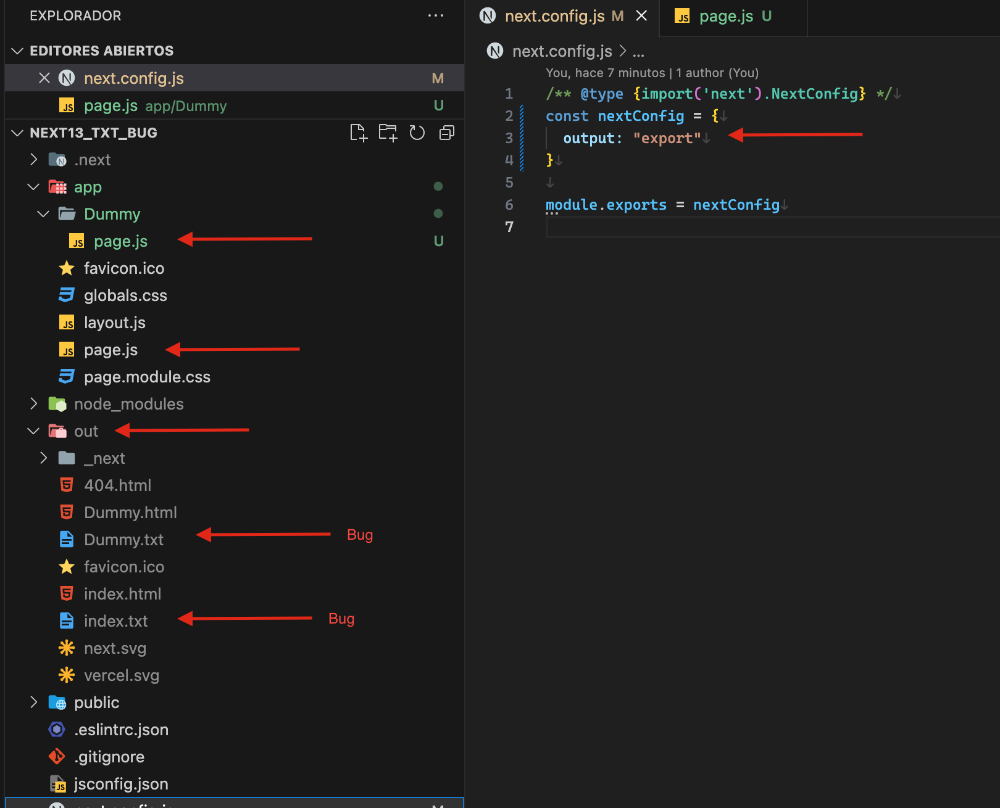

# Bug documentation 
## .txt files added to generated pages and extra script tags

- Output directory (/out/) created after 'npm run build' with .txt extra files each page

- Dummy page has been generated as Static

- Many < script > tags added to the end of generated .html page for every page (lot of extra code for simple static page)

